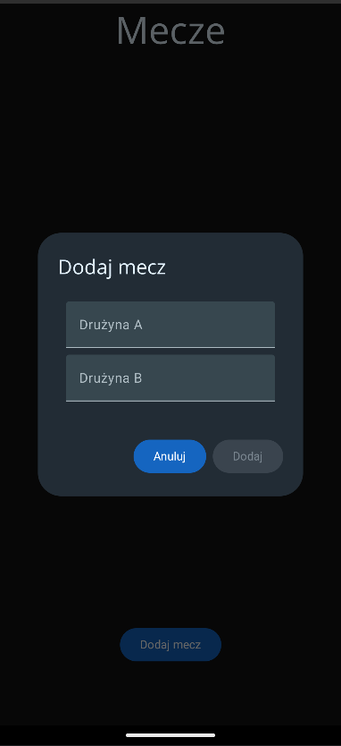
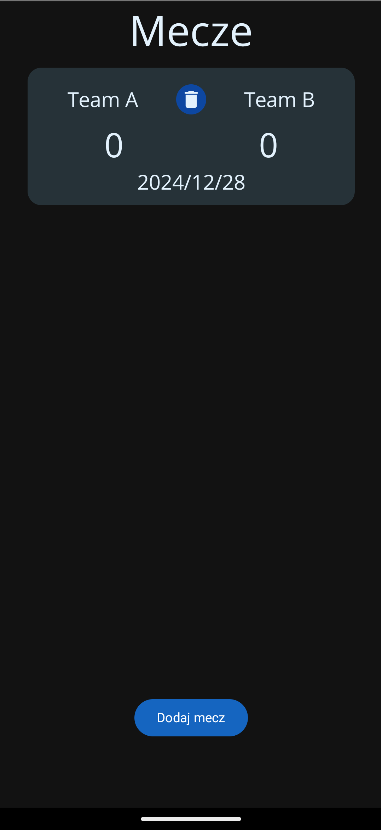
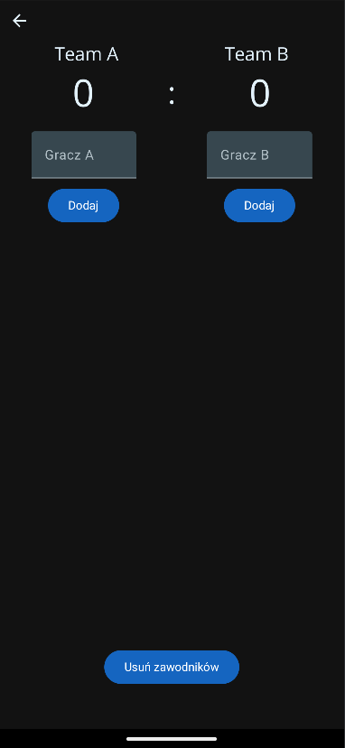
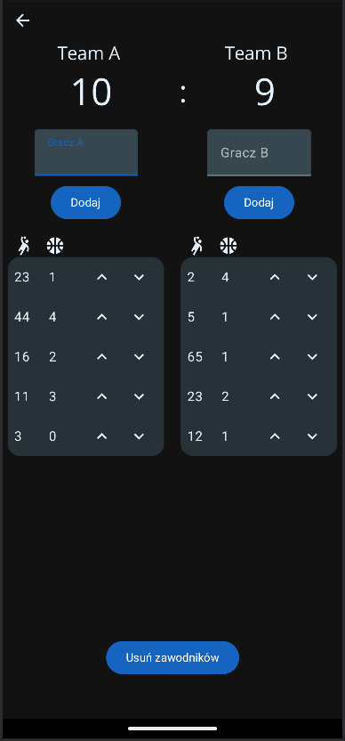
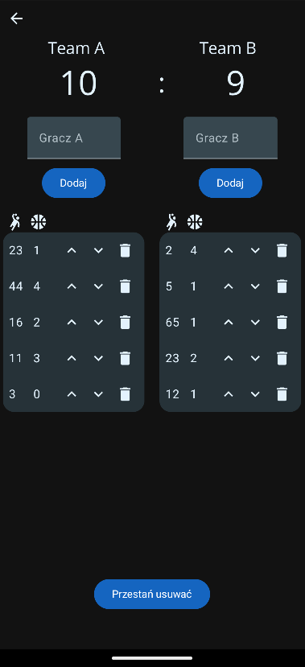

# Handball Goal Counter

### A Modern Tool for Handball Match Officials

---

## Introduction
**Handball Goal Counter** is an Android application designed to assist table officials in managing and recording handball match statistics. Built with Kotlin and Jetpack Compose, this app simplifies the process of tracking goals scored by players, reducing the need for manual counting when filling out the match protocol after the game.

The application connects to a local SQLite database via the Room database library, ensuring data persistence and reliability throughout the match.

---

## Features
- **Match Management:** Create new matches in the database and delete them when no longer needed.
- **Team Management:** Add players to specific teams participating in the match.
- **Goal Tracking:** Add or remove goals for each player with automatic updates to the match score.
- **Player Management:** Remove players from matches as required.
- **Data Persistence:** All data is stored locally in an SQLite database, ensuring stability and offline availability.

---

## Technologies Used
- **Programming Language:** Kotlin
- **UI Framework:** Jetpack Compose
- **Database Management:** SQLite
- **ORM Library:** Room Database
- **IDE:** Android Studio

---

## Application Demo
- **Adding new match:**
  
  
- **Main screen with added match:**

  
- **Showing newly added match details:**

  
- **Match details with players and goals:**

  
- **Main screen with added match:**

  
---

## Future Development Plans
1. **Sorting and filtering matches:** Sorting matches by date, goal count and more.
2. **Cloud Synchronization:** Enable data backup and synchronization across devices.
3. **User Authentication:** Add support for login and user roles.

### License
This project is available for use under the MIT License.

